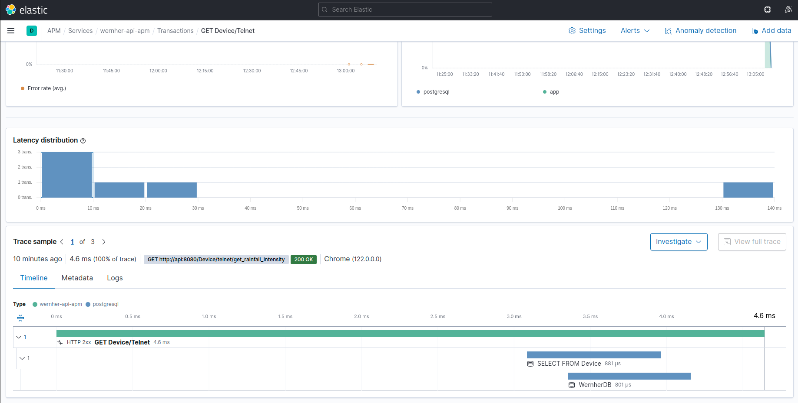
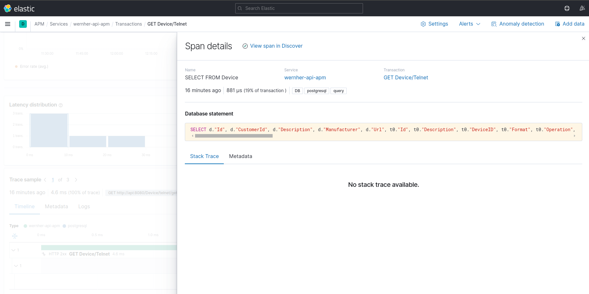
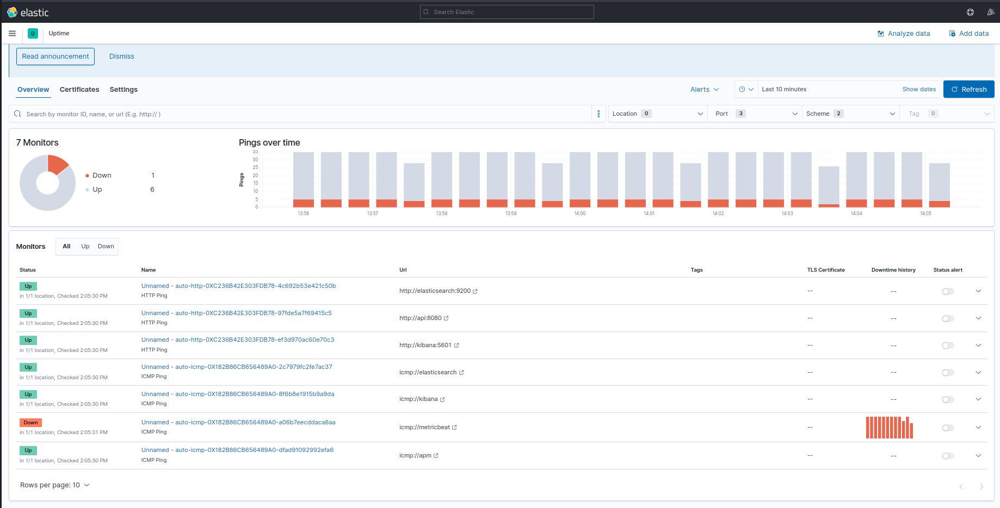
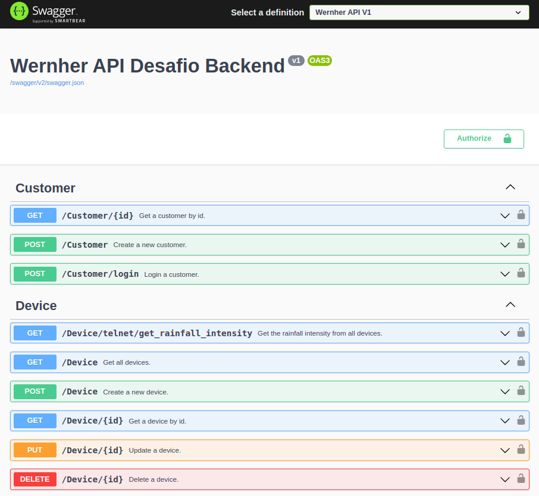

# vaga-backend-desafio-wernher

## Como rodar o projeto

Clone e entre no projeto
```sh
git clone git@github.com:AdsonFS/vaga-backend-desafio-wernher.git
cd vaga-backend-desafio-wernher 
```

> [!IMPORTANT]  
> Dê permissão *root* para o arquivo metricbeat.yml
> ```sh
> sudo chown root beats/metric/metricbeat.yml
> ```

Suba os serviços no docker compose na ordem:
```sh
docker compose up -d --build db
```
```sh
docker compose up -d --build
```

Acesse o Swagger da [API](http://localhost:8080/swagger/index.html) pelo Nginx.
Acesse o [Kibana](http://localhost:5601/app/home#/) para monitorar.
> [!NOTE]  
> Optei por deixar o Swagger em produção para facilitar os testes.

## Notas Importantes

* Criei um servidor telnet com Go para simular a resposta dos aparelhos.

* No docker compose, subi 3 instâncias, entao ao cadastrar um equipamente, use URL = telnet1 ou telnet2 ou telnet3.

* Optei por nao criar DTO (Data Transfer Object) para os devices, pois a unica alteração seria remover o id, então apenas o removi do json na response.

* Na busca de dados via telnet, abro uma thread paralela para cada device, melhorando o tempo total.

* No Nginx, configurei um tempo de cache para a rota *device/telnet/get_rainfall_intensity", assim evita multiplas requisicoes em espaço de tempo, afinal, dados sobre chuva não mudam rapidamente (deixei apenas 5s de cache para facilitar testes).

* Também configurei um limit rate no Nginx para apenas 1 requisição por segundo, bloquenado uso indevido da API.

* Não usei o padrão complete Service + Repository porque por enquanto não havia necessidade, então faço uso somente do Repository.


## Tecnologias

AspNet 8, Go, Nginx, Docker, Docker Compose, ElasticStack (apm, log, metric, health)

## Telas
Metricas sobre status code, perfrmance e uso geral.


Trace de cada requisição


Uptime


Swagger
